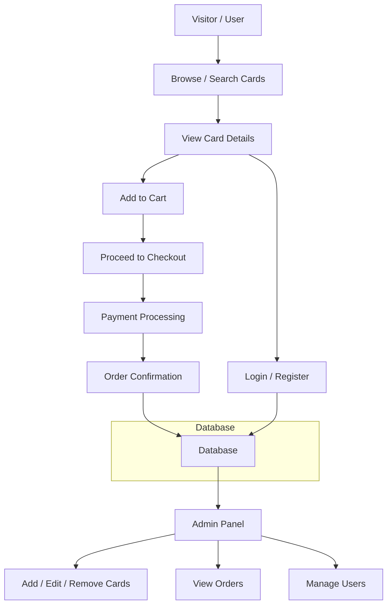

# TCG Web Project

This project is a **web-based collectible card database** that allows users to browse cards, view details, and search by sets or numbers. The website is built using **HTML, CSS, and JavaScript** with a focus on dynamic rendering and responsive design for mobile and desktop devices.

You can view the live website here: **[Nathan TCG Live Site](https://nathan-tcg.onrender.com/)**

---

## Features Completed

* Basic layout of the website (header, tab bar, card grid, footer)
* Dynamic rendering of card data onto the grid
* Responsive card images and consistent card styling
* Basic navigation between pages (linking cards to detail pages)
* Tab bar with hover and active styles
* Basic search form integration

---

## Purpose of Python and Flask

* **Python**: Server-side language for handling backend logic, such as serving pages, managing card data, and handling user input.
* **Flask**: Lightweight Python web framework to:

  * Route URLs to Python functions
  * Dynamically inject data into HTML via Jinja2 templates
  * Serve JSON for dynamic front-end rendering
  * Handle forms and user inputs

Flask makes the website **dynamic** and enables backend integration like database management, authentication, and payments.

---

## Flow Diagram: User, Admin, and Payments



This shows the flow from a user browsing cards to completing a purchase, and the admin managing the system.

---

## TODO

### Frontend / UI

* [ ] Make fully **mobile-responsive** with media queries
* [ ] Implement **dynamic search and filtering**
* [ ] Add **card detail pages**
* [ ] Optimize **card grid layout**
* [ ] Add **animations/hover effects**
* [ ] Improve **footer and navigation**

### Backend / Server

* [ ] Integrate **database** for cards, users, and orders
* [ ] Implement **user authentication** (login/register)
* [ ] Add **admin panel** for card management
* [ ] Serve card data dynamically with **Flask routes/templates**
* [ ] Create **API endpoints** for search and filtering

### E-commerce / Payments

* [ ] Integrate **payment gateway** (PayPal, Stripe, etc.)
* [ ] Handle **orders and confirmations**
* [ ] Ensure **security** for user data and payments
* [ ] Prevent **duplicate transactions**

### Optional Enhancements

* [ ] Add **PWA functionality** (installable app, offline caching)
* [ ] Optimize **performance** for large datasets
* [ ] Add **reviews, ratings, wishlist**

---

## Project Structure (current)

```
/project-root
├─ index.html
├─ styles.css
├─ script.js
├─ images/
└─ README.md
```

This structure may expand to include backend files (Python/Flask templates, service worker, database files) as development continues.
